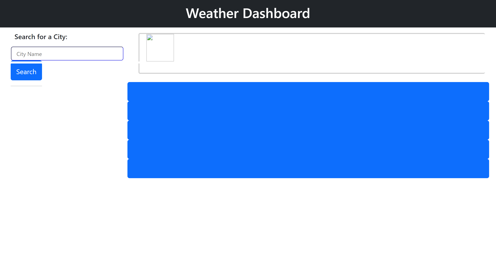

# Weather-dashboard
I created an app that allows users to see the weather forecast for cities of their choosing. It shows the weather for any chosen city for the current day and also the next 5 days. It will show the temperature, humidity and wind-speed.

## Installation

This app will run in the browser using HTML, CSS, JavaScript and Jquery and the application of openweather with an API key.

    
## Screenshots

## Deployment

To deploy this project run

https://cdn.jsdelivr.net/npm/dayjs@1/dayjs.min.js
https://cdnjs.cloudflare.com/ajax/libs/jquery/3.2.1/jquery.min.js

## Credits

- https://cdn.jsdelivr.net/npm/dayjs@1/dayjs.min.js
- https://developer.mozilla.org
- https://edabit.com/challenge/ARr5tA458o2tC9FTN
- https://developer.mozilla.org/en-US/docs/Web/API/Element/removeAttribute
- https://developer.mozilla.org/en-US/docs/Web/API/Element/keyup_event
- https://www.w3schools.com/jsref/dom_obj_all.asp
-  https://api.openweathermap.org/data/2.5/weather?q=;
- https://api.openweathermap.org/data/2.5/onecall?lat;
- https://jquery.com/
- chatGPT
## License

[MIT](https://choosealicense.com/licenses/mit/)

