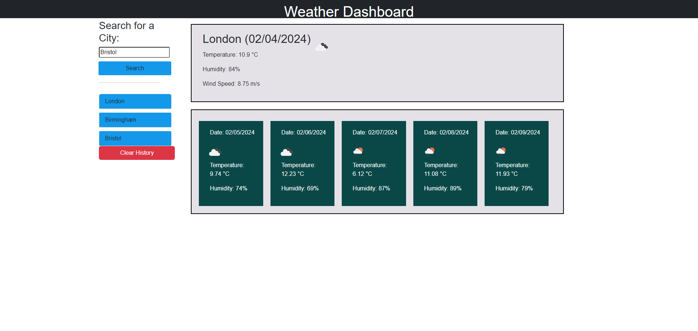

# Weather-dashboard
I created an app that allows users to see the weather forecast for cities of their choosing. It shows the weather for any chosen city for the current day and also the next 5 days. It will show the temperature, humidity and wind-speed.

## Features

- Users can search for a city to view its current and future weather conditions.
- The city is added to the search history for easy access.
- Current weather conditions include:
  - City name
  - Date
  - Weather icon representation
  - Temperature
  - Humidity
  - Wind speed
- Future weather conditions display a 5-day forecast with:
  - Date
  - Weather icon representation
  - Temperature
  - Humidity

## Installation

1. Clone the repository to your local machine:

   ```bash
   git clone git@github.com:YusufDev15/Weather-Dashboard.git
   ```

2. Navigate to the project directory:
  ```bash
  cd Weather-Dashboard/
  ```
3. Open the index.html file in your preferred web browser.

4. Register for an API key at OpenWeatherMap and replace in the code with your API key.

5. Start exploring weather conditions for multiple cities!

    
## Screenshots




## Deployment

To deploy this project run

-https://cdn.jsdelivr.net/npm/dayjs@1/dayjs.min.js
-https://cdnjs.cloudflare.com/ajax/libs/jquery/3.2.1/jquery.min.js

## Technologies Used
- HTML
- CSS
- JavaScript
- OpenWeather API


## Credits


- https://cdn.jsdelivr.net/npm/dayjs@1/dayjs.min.js
- https://developer.mozilla.org
- https://edabit.com/challenge/ARr5tA458o2tC9FTN
- https://developer.mozilla.org/en-US/docs/Web/API/Element/removeAttribute
- https://developer.mozilla.org/en-US/docs/Web/API/Element/keyup_event
- https://www.w3schools.com/jsref/dom_obj_all.asp
-  https://api.openweathermap.org/data/2.5/weather?q=;
- https://api.openweathermap.org/data/2.5/onecall?lat;
- https://jquery.com/
- chatGPT
## License

[MIT](https://choosealicense.com/licenses/mit/)

